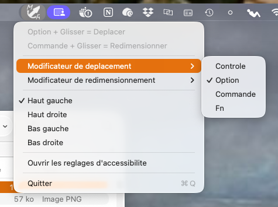

# Moveresize
[French version here](README.fr.md)


<table style='border:0px'>
	<tr>
		<td style="vertical-align:middle; text-align:center; width: 50%; min-width: 400px;">
			
		</td>
		<td style="vertical-align:top;">
			<p>
				
				
				
			</p>
			<p>
				macOS utility in Swift to move and resize a window with the mouse while holding a modifier key.
			</p>
			<!-- Table des matières -->
			<ul>
				<li><a href="#features">Features</a></li>
				<li><a href="#installation--launch">Installation & Launch</a></li>
				<li><a href="#usage">Usage</a></li>
				<li><a href="#license--support">License & Support</a></li>
			</ul>
		</td>
	</tr>
</table>


## Features

- `Option` + left click + drag: move the window under the cursor.
- `Command` + left click + drag: resize the window under the cursor.
- Menu to choose the modifier for `Move` and `Resize` (`Control`, `Option`, `Command`, `Fn`).
- Choose the resize anchor: `Top Left`, `Top Right`, `Bottom Left`, `Bottom Right`.
- Menu interface follows system language (English, French, Spanish, fallback to English).
- Requests Accessibility permission at launch.


## Installation & Launch

[Download dmg file to install the application](Moveresize.dmg)
```bash
swift run
```

On first launch:
1. Authorize the app in `System Settings > Privacy & Security > Accessibility`.
2. If macOS blocks mouse capture, also allow `Input Monitoring`.
3. Relaunch the app if needed.


## Usage

- Use the keyboard + mouse shortcuts to move or resize windows.
- Access preferences via the menu bar icon.


## License & Support

This is an open-source project under the MIT license.

You can support my work here: [https://www.patas-monkey.com/boutique/](https://www.patas-monkey.com/boutique/)

Subscribe to my Youtube channel: [https://www.youtube.com/@charlene-patasmonkey](https://www.youtube.com/@charlene-patasmonkey)

Or send me a message of encouragement here: https://www.patas-monkey.com/formulaire-de-contact/
